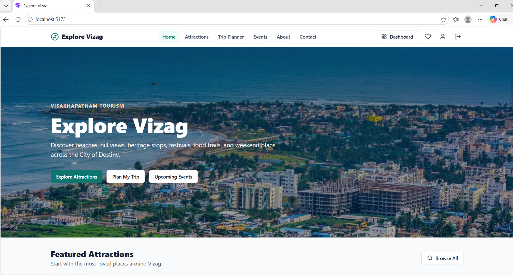
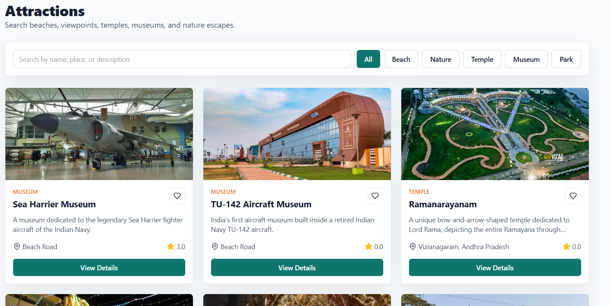
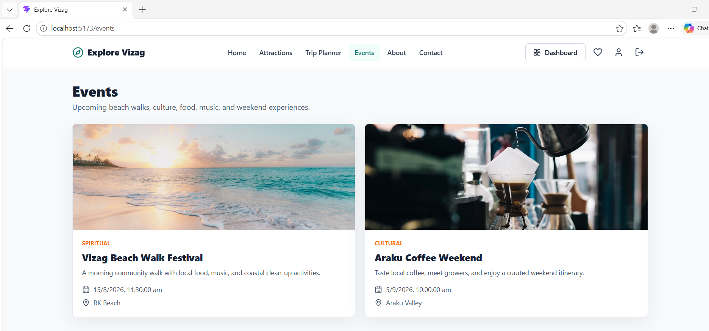
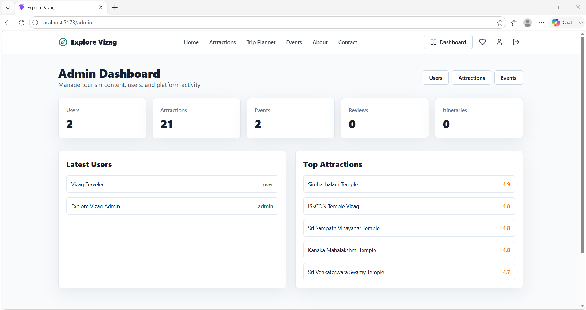
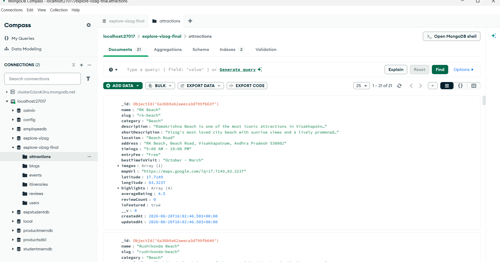
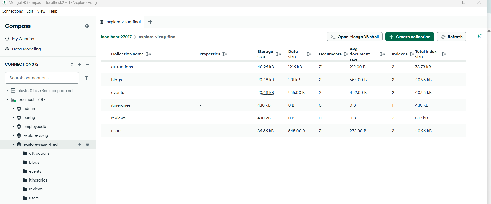

# Explore Vizag - MERN Tourism Management Platform

## Overview

Explore Vizag is a full-stack MERN application designed to help tourists discover, plan, and manage trips across Visakhapatnam (Vizag). The platform provides detailed information about tourist attractions, temples, beaches, museums, events, and travel itineraries while offering an admin dashboard for content management.

---

## Features

### Public Features

* Browse tourist attractions
* Search and filter attractions by category
* View detailed attraction information
* Explore upcoming events
* User registration and login
* Save favorite attractions
* Create and manage personal itineraries
* User profile management
* Responsive design for desktop and mobile devices

### Admin Features

* Secure admin authentication
* Admin dashboard with statistics
* Add, edit, and delete attractions
* Manage events
* Manage users
* Upload attraction images
* Content management system

---

## Technology Stack

### Frontend

* React.js
* React Router DOM
* Axios
* Tailwind CSS
* Vite

### Backend

* Node.js
* Express.js
* MongoDB
* Mongoose
* JWT Authentication
* Multer
* Cloudinary

### Database

* MongoDB

---

## Project Structure

```text
Explore-Vizag/
│
├── frontend/
│   ├── src/
│   │   ├── components/
│   │   ├── pages/
│   │   ├── context/
│   │   ├── services/
│   │   └── App.jsx
│   │
│   ├── package.json
│   └── vite.config.js
│
├── backend/
│   ├── src/
│   │   ├── config/
│   │   ├── controllers/
│   │   ├── middleware/
│   │   ├── models/
│   │   ├── routes/
│   │   ├── seed/
│   │   ├── utils/
│   │   ├── app.js
│   │   └── server.js
│   │
│   └── package.json
│
└── README.md
```

---

## Installation

### Clone Repository

```bash
git clone https://github.com/rongalicharishma3-collab/MERN-stack.git
cd Explore-Vizag
```

---

## Backend Setup

```bash
cd backend
npm install
```

Create a `.env` file:

```env
PORT=5000
NODE_ENV=development
MONGO_URI=mongodb://localhost:27017/explore-vizag-final
JWT_SECRET=your_secret_key
JWT_EXPIRES_IN=7d
CLIENT_URL=http://localhost:5173
```

Start Backend:

```bash
npm run dev
```

---

## Frontend Setup

```bash
cd frontend
npm install
```

Create a `.env` file:

```env
VITE_API_URL=http://localhost:5000/api
```

Start Frontend:

```bash
npm run dev
```

---

## Database Seeding

To populate sample attractions, events, and users:

```bash
npm run seed
```

Sample Credentials:

### Admin

```text
Email: admin@explorevizag.com
Password: Admin@123
```

### User

```text
Email: user@explorevizag.com
Password: User@123
```

---

## API Modules

### Authentication

* Register User
* Login User
* JWT Authentication

### Attractions

* Get Attractions
* Get Attraction Details
* Create Attraction
* Update Attraction
* Delete Attraction
* Favorite Attractions

### Events

* Create Events
* View Events
* Manage Events

### Users

* Profile Management
* Favorites Management
* Role-Based Authorization

### Dashboard

* Admin Statistics
* Content Overview

---

## Security Features

* JWT Authentication
* Password Hashing using bcrypt
* Role-Based Access Control
* Protected Routes
* Input Validation

---

# Project Screenshots

## Home Page



## Attractions Page



## Events Page



## Admin Dashboard



## Attractions Database



## Database Collections


## Future Enhancements

* Hotel Booking Integration
* AI Travel Recommendations
* Weather Information
* Real-Time Notifications
* Multi-language Support
* Online Ticket Booking
* Interactive Maps

---

## Author

 Team-16
* RONGALI CHARISHMA
* RAVURI GAYATHRI
* GOMPA ANIL PAUL
* GOPPU GANESH ABHISHEK KUMAR
* SALAPU SIVA KUMAR


MERN Stack Developer Project

Explore Vizag Tourism Management Platform
